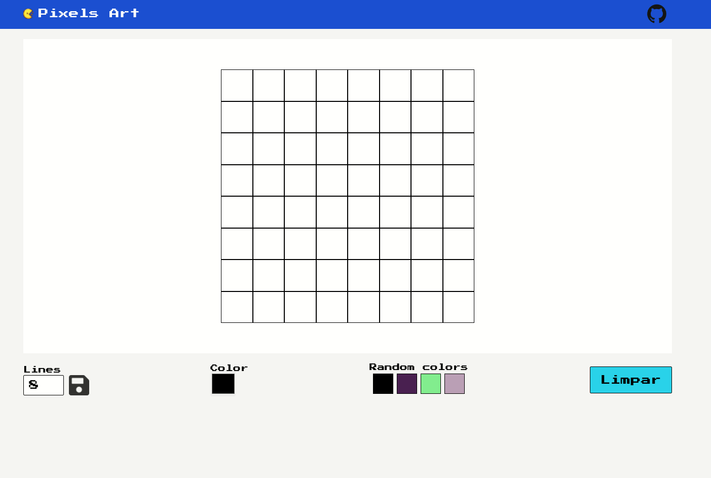

<h1 align="center">Pixels Art</h1>

  

#### :computer: Descrição

Tela de desenho usando pixels com uma paleta de cores aleatória

#### :nut_and_bolt: Tecnologias

Esse projeto foi desenvolvido com as seguintes tecnologias:

- [HTML5][html]
- [CSS3][css]
- [Javascript][js]
- [TailwindCSS][tail]

[html]: https://developer.mozilla.org/pt-BR/docs/Web/HTML
[css]: https://developer.mozilla.org/pt-BR/docs/Web/CSS
[js]: https://developer.mozilla.org/pt-BR/docs/Web/JavaScript
[tail]: https://tailwindcss.com/

#### :star2: Habilidades

- Manipular o DOM
- Manipular o Javascript

#### :thinking: Como rodar

Você pode abrir o index.html no seu navegador ou usar a extenção [Live server]("https://marketplace.visualstudio.com/items?itemName=ritwickdey.LiveServer")

#### :bust_in_silhouette: Autores

<table>
  <tr>
    <td align="center">
      <a href="https://github.com/defauth98">
        
         
          
            <b>Daniel Ribeiro</b>
          
      </a>
    </td>
  </tr>
</table>
